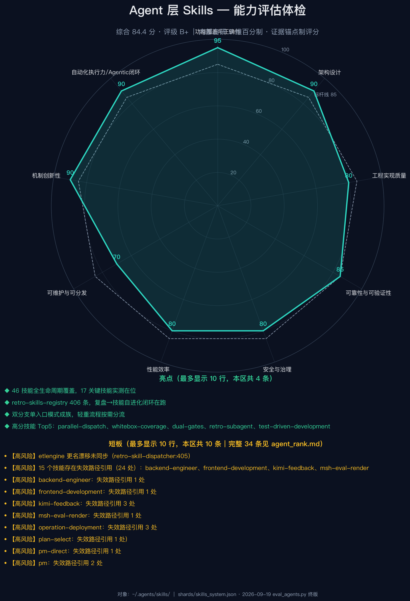

# dsh-skills

[](LICENSE)
[](https://github.com/xu-jin-cs/dsh-skills/commits/main)
[](https://www.python.org/downloads/)
[](#compatibility)

**English** | **[中文说明](README_zh.md)**

Mechanical gates and reusable skills that make LLM coding agents *keep their promises* — capability evaluation, parallel dispatch, architecture cartography, and a full PM workflow. Plain `SKILL.md` files, zero lock-in: DeepSeek Harness, Claude Code, Kimi Code, Codex, and any agent that reads the standard skill format.



## Why this repo

Most agent skills *hope* the model follows instructions. This repo **moves judgment from the model to scripts**: spec-driven gates mechanically verify what the agent claims (A = pass / B = block with violations), parallel fan-out goes through an audited switch, and architecture mapping is deterministic computation instead of full-repo re-reading.

The lead hook is **[agent-eval](#skills) — agent/skills capability evaluation**: read-only collection of every skill on your machine → 9-dimension scoring against a frozen baseline → strength/weakness grading (blocking / high-risk / optimization) → overall ranking → radar chart + leaderboard + HTML report. Evaluation tooling for agents is the gap; the RAG/ETL engine ([Xj-engine](#xj-engine)) plays support.

## 60-second quickstart

```bash
# 1. Install the repo skills (symlinks into your skill discovery root)
curl -fsSL https://raw.githubusercontent.com/xu-jin-cs/dsh-skills/main/scripts/dsh-skill.sh | bash -s -- install agent-eval archmap --with-deps

# 2. Score all your local agent skills → radar + leaderboard + HTML report
python3 ~/.dsh/dsh-skills/agent-eval/scripts/eval_agents.py --mode generic

# 3. Watch a mechanical gate verify this repo's own README (run from the repo root)
python3 Xj-rules/store-package/skills/gate-switch/scripts/gate_switch.py --spec examples/gate-switch/demo_spec.json --set target=README.md
```

Sample outputs are checked in: [radar](agent-eval/images/agent_radar.png) · [leaderboard](agent-eval/images/agent_rank.png) · more in [examples/](examples/).

## Skills

| Skill | What it does |
|-------|--------------|
| [`agent-eval`](./agent-eval/SKILL.md) | Agent/skills capability evaluation & visual reports. Read-only collection → 9-dimension frozen-baseline scoring → three-tier strength/weakness verdicts with action guidance → overall ranking → dark-tech radar chart + rank board + HTML report. |
| [`archmap`](./archmap/SKILL.md) | Architecture cartography agent (self-contained Python engine). Zero-arg full/lite auto-routing; requirement text → precise impact surface (file/function/route level); `diff` mode: zero-LLM line-level impact + import closure + test selection + change ledger; `sync` incremental baseline refresh. Deterministic computation instead of full-repo reading — massive token savings. |
| [`gate-switch`](./Xj-rules/store-package/skills/gate-switch/SKILL.md) 📦 | Universal probabilistic-execution gate skeleton (evidence-family engine, zero deps). Cures three LLM chronic failures: skipped steps / half-done checklists / fabricated "done" claims. Write what must be true as a spec JSON; the engine mechanically verifies each check — A passes, B blocks with the violations as the reason. 7 frozen check primitives (`file_exists` / `json_field` / `glob_count` / `grep_count` / `mtime_after` / `script_exit` …) + ready-made gate instances + an L3 framework-gate template. New scenario = new spec, zero engine changes. |
| [`parallel-dispatch`](./Xj-rules/store-package/skills/parallel-dispatch/SKILL.md) 📦 | Master rules for parallel dispatch & sub-agent clones. ≥2 independent subtasks trigger parallel fan-out by default; two-axis decision (scale: light clone / task-breakdown / engine-level × count: subagent / grouped / workflow); scene auto-matching, minimal probe, merge checkpoints — all through the audited `dispatch_switch` SPDT gate (A/B verdict, no handwritten decisions). |

> 📦 `gate-switch` and `parallel-dispatch` full sources ship inside the [`Xj-rules` store package](./Xj-rules/store-package/skills/) (57 skills, also as `store-package-full.zip` / `-lite.zip`); copy the skill folder into your discovery root to use. `agent-eval` and `archmap` are tracked top-level repo skills, installable via the one-liner above.

## Xj-agent — full-lifecycle PM workflow

A self-contained **PM orchestration skeleton** (13 nodes: pm_bootstrap → spm → pm_prd_confirm → dpm → [ui_designer ∥ test_lead_design] → fe → be → pm_quality_gate → test_lead_full → ops → qa → process_audit → retro), wired by default to this repo's [Xj-engine](#xj-engine) and pluggable via env vars. Ships with 11 role skills under `Xj-agent/agents/` so the workflow runs out of the box.

```bash
pip install -r Xj-agent/pm/requirements.txt
python3 Xj-agent/pm/scripts/flow_kernel.py routes --rules Xj-agent/pm/flow.yml --node be
```

## Xj-engine

The standalone engine (`engine.kernel.et` / `xj-engine` CLI): ETL + task domain + bridge executor, local database, `pip install -e .` installable. See [`Xj-engine/`](./Xj-engine/).

## Compatibility

| Agent | Skill directory |
|---|---|
| DeepSeek Harness | `~/.dsh/skills` or `~/.agents/skills` (watcher hot-reload) |
| Claude Code | `~/.claude/skills` |
| Kimi Code | `~/.agents/skills` |
| Codex | `~/.codex/skills` |

Skills are plain `SKILL.md` + YAML frontmatter; only the discovery root differs between agents.

## Install

**One-liner (recommended, no clone needed)**

```bash
# List all skills
curl -fsSL https://raw.githubusercontent.com/xu-jin-cs/dsh-skills/main/scripts/dsh-skill.sh | bash -s -- list

# Install one skill (symlinked into ~/.dsh/skills, hot-reloaded by DSH's watcher)
curl -fsSL https://raw.githubusercontent.com/xu-jin-cs/dsh-skills/main/scripts/dsh-skill.sh | bash -s -- install archmap

# Everything + dependencies
curl -fsSL https://raw.githubusercontent.com/xu-jin-cs/dsh-skills/main/scripts/dsh-skill.sh | bash -s -- install --all --with-deps
```

First run shallow-clones this repo to `~/.dsh/dsh-skills` (override with `DSH_SKILLS_HOME`); all later commands run locally.

**Already cloned**

```bash
git clone https://github.com/xu-jin-cs/dsh-skills.git
cd dsh-skills
./install.sh                # interactive picker
./install.sh archmap        # a specific skill
./install.sh --all          # everything
```

CLI subcommands (`scripts/dsh-skill.sh`): `list` / `install` (`--copy`, `--target DIR`, `--with-deps`) / `uninstall` / `update` / `doctor`.

## Principles

1. **Lightweight** — rule-type skills are a single `SKILL.md`; engine-type skills are self-contained with explicit `requirements.txt`.
2. **Universal** — no private engine logic, no backend lock-in; standard `SKILL.md` works across agent hosts.
3. **Auto-trigger** — triggers live in each skill's `description`; the host injects them into the session catalog for scene matching.

## Methodology

The governance philosophy behind these skills, plus a 27-case battle retrospective: [Mechanical Gates for LLM's Verbal Promises](./docs/mechanical-gates-for-llm.en.md) ([中文版](./docs/mechanical-gates-for-llm.md)) — the Mandatory-Completion Gate meta-method, L1/L2/L3 gate levels, skeleton-freeze discipline, and the "1 proven case + N named siblings" generalization gate.

## Contributing

Every release passes a pre-publish compatibility checklist (portable paths / zero credentials / no private deps / hygiene scan). See 「上传必看」 in [README_zh.md](README_zh.md).

## License

[MIT](LICENSE)
