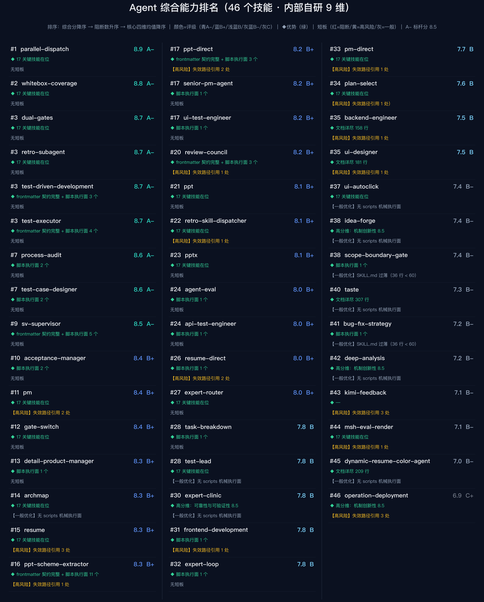

# agent-eval — Agent/Skills 专项能力评估·可视化报告

一条命令执行脚本，对 `~/.agents/skills/` 下全部 Agent 技能做**只读实测采集 → 9 维评分 → 强弱三级识别 → 综合排名**，产出深色科技风的可视化评估报告（雷达图 + 排名榜 + Markdown + HTML + JSON shards）。

## 效果预览（实跑产出）

**图1 · Agent 多维度能力雷达**（体系 9 维 + 亮点/短板清单区，每条约独立成行、各最多 10 行）


**图2 · Agent 综合能力排名榜**（全部技能卡片式上榜：排名+综合分+评级 / 优势 / 短板带严重等级）



## 一键安装

```bash
curl -fsSL https://raw.githubusercontent.com/xu-jin-cs/dsh-skills/main/agent-eval/install.sh | bash
```

自动完成：下载本技能 → 安装到 `~/.agents/skills/agent-eval/`（可用 `AGENT_EVAL_TARGET` 改目标根）→ 检查/安装依赖（matplotlib、numpy）→ 语法冒烟验证。

也可以 clone 整仓库后用统一安装器（支持交互选择/多技能/指定目标根）：

```bash
git clone https://github.com/xu-jin-cs/dsh-skills.git
cd dsh-skills && ./install.sh --target ~/.agents/skills agent-eval
```

## 快速开始

```bash
python3 scripts/eval_agents.py                 # 默认：内部自研 9 维模式
python3 scripts/eval_agents.py --mode generic  # 通用 7 基础维（可选维降权）
python3 scripts/eval_agents.py --compare <上轮 shards/skills_system.json>  # 两轮雷达叠加对比
python3 scripts/eval_agents.py --config cfg.json  # 换一套 Agent 目录/白名单/阈值
```

依赖：`matplotlib`、`numpy`（缺 matplotlib 时脚本自动尝试 `~/.browser-use-env/bin/python3`）。

## 评估口径（摘要）

- **体系级 9 维**：冻结基线 + 实测信号确定性加减（关键技能缺失阶梯扣分 -0.3/个上限 -1.0、全齐 +0.5、零路径漂移 +0.5、retro 水位阈值绑定开关）；clamp [0,10] 步进 0.5，评级 A-≥85 / B+≥80 / B≥75 …
- **逐技能机械评分**：frontmatter 契约 / 文档行数 / scripts 执行面 / 失效路径引用 / 关键词组，全部可由文件信号复现，无主观裁量。
- **短板三级**：【阻断】frontmatter 缺失 ＞【高风险】失效路径引用 ＞【一般优化】文档/执行面完善，每条带行动指引。
- **排名**：综合分降序 → 阻断数升序 → 核心四维均值降序，同分并列。

## 产出物（默认 `~/Desktop/agent-skills-eval-<日期>/`）

| 文件 | 内容 |
|---|---|
| `images/agent_radar.png` | 图1 多维能力雷达（底部强弱清单区，底边锚定紧凑排列） |
| `images/agent_rank.png` | 图2 综合能力排名榜（卡片式，全部技能上榜） |
| `agent_rank.md` | 排名总表 + 迭代调整方向 + 各技能详情 + 筛选指引 |
| `baseline.md` | 体系评分 + 加减分 notes + Top10 |
| `report.html` | 深色一页报告（两图 + 评分表 + 排名总表） |
| `shards/*.json` | 体系级 / 逐技能结构化评分数据 |

## 规则

1. 全程只读，不改动任何被评估技能文件；2. 证据锚点制，调分必须落在脚本代码里；3. 范围仅 Agent/Skills（RAG/引擎/规则闸不在此列）；4. 产出全部原子写。

技能契约详见 [SKILL.md](SKILL.md)。
